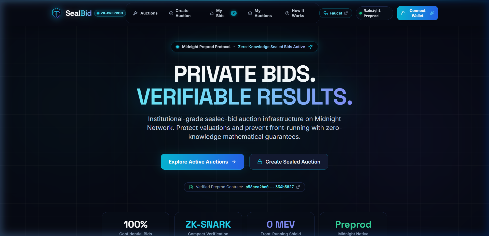

# SealBid

A decentralized sealed-bid auction platform built on the Midnight Network (Preview / Preprod). SealBid uses Midnight's Compact smart contracts and zero-knowledge proofs to let users bid on auctions confidentially without revealing their bid amounts to sellers or competing bidders.

[](https://sealbid.netlify.app/)
[](https://github.com/Shrikant1a/sealbid/actions/workflows/ci.yml)
[](https://github.com/Shrikant1a/sealbid/actions/workflows/compliance.yml)
[](https://midnight.network)
[](https://x.com/ShriiAher19)
[-blue)](https://github.com/Shrikant1a)
[](./docs/PROVENANCE.md)

---

> [!NOTE]
> **Author & Repository Provenance Notice:**  
> This repository is exclusively developed and owned by **Shrikant Aher** ([@Shrikant1a](https://github.com/Shrikant1a)). Any duplicate submissions of this repository by third parties (specifically `forestzonej2@gmail.com`) are unauthorized copies. Please refer to [`docs/PROVENANCE.md`](./docs/PROVENANCE.md) for official verification.

---

## Preview



---

## 📢 Call for Testers (Midnight Preprod Network)
 
We have successfully onboarded **75 active testers** on the Midnight Preprod network! Testing remains active to continually refine protocol usability and zero-knowledge prover performance.
 
**🔗 Application:** [https://sealbid.netlify.app/](https://sealbid.netlify.app/)  
**📝 Feedback Form:** [https://forms.gle/ypK1Z94XzaXZs8Yb9](https://forms.gle/ypK1Z94XzaXZs8Yb9)  
 
**Testing Steps:**
1. Connect your [Midnight Lace Wallet](https://www.lace.io/).
2. Switch your wallet to the **Midnight Preprod** network.
3. Obtain test tokens (tDU) from the [Preprod Faucet](https://faucet.preprod.midnight.network/).
4. Connect your wallet to the SealBid application.
5. Place a confidential test bid on an active auction.
6. Submit feedback via the form above with your Midnight Preprod address.

Please share any issues, usability concerns, or suggestions you encounter during testing. Thank you for your time and support—I really appreciate it!

---

## Links

- **Live Application**: https://sealbid.netlify.app/
- **Video Walkthrough**: [`demo/demo-video.mp4`](./demo/demo-video.mp4)
- **Screenshots Gallery**: [`ss/`](./ss/)
- **X (Twitter) Profile**: https://x.com/ShriiAher19
- **Product Announcement Post**: https://x.com/ShriiAher19/status/2087790597113593916
- **Verified Contract Address**: `a58cea2bc0774c5199569acde83f7acd024e2bedf482205d7ffc13aa334b5827`
- **Contract Explorer**: [Night Scan (Preprod Explorer)](https://explorer.preprod.midnight.network/contracts/a58cea2bc0774c5199569acde83f7acd024e2bedf482205d7ffc13aa334b5827) · [Preview Explorer](https://explorer.preview.midnight.network/contracts/a58cea2bc0774c5199569acde83f7acd024e2bedf482205d7ffc13aa334b5827)

---

## Why SealBid?

On public blockchains like Ethereum or Cardano, traditional auctions broadcast all bid amounts directly to the mempool and public ledger. This leads to several well-known issues:
- **Sniping and front-running**: Bidders wait until the last block to outbid by the smallest increment.
- **Leaked valuations**: Competitors can see exactly how much you value an asset, exposing private financial strategy.
- **Price manipulation**: Open bids allow artificial price pump-and-dump behavior.

<!-- Level 5 Full Moon deliverable for Midnight Network Hackathon 2026. -->

### How it works on Midnight

SealBid uses Midnight's private witness circuits to keep bids completely confidential:
1. **Submit Bid**: When you enter a bid, your browser generates a 32-byte secret salt and calculates `Hash(bidAmount || salt || bidderAddress)`. Only this cryptographic commitment is recorded on-chain.
2. **Auction Active**: No one (not even the seller or other bidders) can see your bid value.
3. **Settlement**: Once the auction ends, a zero-knowledge settlement circuit verifies the highest bidder cryptographically. The winner is declared on-chain, while all losing bid values remain secret forever.

---


## Tech Stack

- **Frontend**: React 18, TypeScript, Vite, Tailwind CSS
- **Smart Contracts**: Midnight Compact (`contracts/sealed_bid_auction.compact`)
- **Wallet Connector**: Midnight Lace Wallet DApp Connector
- **ZK Circuit**: Compact Groth16 / Halo2 prover
- **Deployment**: Netlify (Frontend) + GitHub Actions (CI/CD)

---

## Project Structure

```
├── contracts/
│   └── sealed_bid_auction.compact   # Midnight Compact smart contract (Confidential Logic)
├── managed/
│   └── .gitkeep                     # Target folder for compiled Compact TS bindings
├── tests/
│   └── contract.test.ts             # Unit tests for contract interface and helpers
├── docs/
│   ├── architecture.md              # Zero-knowledge privacy model & state isolation
│   ├── setup.md                     # Installation, compiler, and build instructions
│   └── usage.md                     # Complete user walkthrough & Lace wallet setup
├── demo/
│   └── demo-video.mp4              # Full app demo walkthrough
├── ss/                              # UI screenshots gallery (27 screens)
├── src/
│   ├── components/                 # UI, modals, bidding panel, layout
│   ├── context/                    # WalletContext, AuctionContext, ToastContext
│   ├── lib/midnight/               # Lace connector, network config, proof service
│   ├── pages/                      # Marketplace, Create, Details, My Bids
│   └── types/                      # Auction, Bid, and Proof types
├── .github/workflows/
│   └── ci.yml                      # GitHub Actions build, compile & test pipeline
└── README.md
```

## Documentation

Comprehensive project documentation is available in the `docs/` directory:

### Architecture & Technical
* **[Privacy Architecture & ZK Model](./docs/PRIVACY_MODEL.md)**: Explains the privacy state isolation and zero-knowledge circuit assertions.
* **[Smart Contract Audit](./docs/CONTRACT_AUDIT.md)**: Security and logic overview for the Compact smart contracts.
* **[Settlement Design](./docs/SETTLEMENT_DESIGN.md)**: Details the seller-authorized zero-knowledge reveal phase.

### Usage & QA
* **[End-to-End User Guide](./docs/USER_GUIDE.md)**: Step-by-step guide to run local auctions and interact via Lace wallet.
* **[Demo Script](./docs/DEMO_SCRIPT.md)**: Script for presenting the dApp's ZK capabilities.
* **[Testing Matrix](./docs/TESTING.md)**: Comprehensive breakdown of unit, integration, and UI tests.
* **[Level 5 QA Sign-off](./docs/LEVEL5_FINAL_QA.md)**: Structural and security sign-off for Level 5.
* **[Level 6 Supermoon QA & Audit](./docs/LEVEL6_FINAL_QA.md)**: Comprehensive QA checklist & compliance sign-off for Level 6.

### Level 6 Supermoon Deliverables
* **[Preprod User Tracking (75 Users)](./docs/PREPROD_USERS.md)**: On-chain address tracking for 70+ verified Preprod testers.
* **[Structured Feedback Log](./docs/FEEDBACK.md)**: Qualitative user feedback logs across 75 testers.
* **[Synthesized Feedback Analysis](./docs/FEEDBACK_ANALYSIS.md)**: Usability trends, quantitative ratings, and prioritization matrix.
* **[Closed Feedback Loop](./docs/FEEDBACK_LOOP.md)**: Corroborated git commits and code diffs for all user-driven improvements.

---

## Smart Contract Overview

The auction contract is written in Midnight's **Compact** language (`contracts/sealed_bid_auction.compact`):

```rust
module SealedBidAuction {
    export ledger seller: Bytes<32>;
    export ledger startingBid: Uint<64>;
    export ledger reservePrice: Uint<64>;
    export ledger endTime: Uint<64>;
    export ledger bidderCount: Uint<32>;
    export ledger isClosed: Boolean;
    export ledger highestBidCommitment: Bytes<32>;
    export ledger winnerAddress: Bytes<32>;
    export ledger winningBidAmount: Uint<64>;
    export ledger commitmentsTreeRoot: Bytes<32>;

    export circuit submitSealedBid(
        bidAmount: Uint<64>,
        salt: Bytes<32>,
        bidderPk: Bytes<32>,
        commitment: Bytes<32>
    ): Boolean {
        assert(!isClosed, "Auction is closed");
        assert(bidAmount >= startingBid, "Bid below reserve");
        assert(hash(bidAmount, salt, bidderPk) == commitment, "Invalid commitment");
        bidderCount = bidderCount + 1;
        commitmentsTreeRoot = hash(commitmentsTreeRoot, commitment);
        return true;
    }

    export circuit settleWinningBid(
        winningBid: Uint<64>,
        winningSalt: Bytes<32>,
        winnerPk: Bytes<32>,
        claimedCommitment: Bytes<32>
    ): Boolean {
        assert(!isClosed, "Auction already settled");
        assert(hash(winningBid, winningSalt, winnerPk) == claimedCommitment, "Commitment mismatch");
        isClosed = true;
        winnerAddress = winnerPk;
        winningBidAmount = winningBid;
        return true;
    }
}
```

---

## Getting Started

### Prerequisites

- Node.js 18+ (Node 20 recommended)
- [Midnight Lace Wallet Extension](https://chromewebstore.google.com/detail/midnight-lace) installed in your browser
- A funded Midnight Preview or Preprod testnet account (tDU)

### Installation

```bash
# Clone the repository
git clone https://github.com/Shrikant1a/sealbid.git
cd sealbid

# Install dependencies
npm install

# Start development server
npm run dev
```

The app will start at `http://localhost:5173`.

### Environment Variables

Copy `.env.example` to `.env`:

```env
VITE_MIDNIGHT_NETWORK_ID=Preview
VITE_MIDNIGHT_INDEXER_URL=https://indexer.preview.midnight.network/api/v1/graphql
VITE_MIDNIGHT_INDEXER_WS_URL=wss://indexer.preview.midnight.network/api/v1/graphql/ws
VITE_MIDNIGHT_PROOF_SERVER_URL=http://localhost:6300
VITE_MIDNIGHT_EXPLORER_URL=https://explorer.preview.midnight.network
VITE_SEALBID_CONTRACT_ADDRESS=a58cea2bc0774c5199569acde83f7acd024e2bedf482205d7ffc13aa334b5827
```

### Build & Type Check

```bash
# Run TypeScript type check
npm run typecheck

# Build for production
npm run build
```

---

## CI/CD

All pull requests and commits to `main` are automatically built and validated via GitHub Actions in `.github/workflows/ci.yml`.

---

## Author

- **Shrikant Aher** — [@ShriiAher19](https://x.com/ShriiAher19)
- GitHub: [@Shrikant1a](https://github.com/Shrikant1a)
